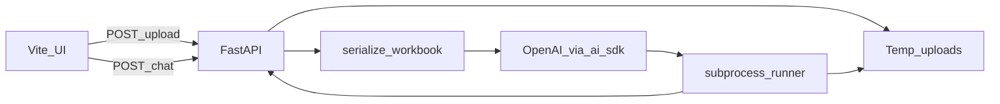

# Spreadsheet Intelligence

**Stack:** Python **FastAPI** backend, **Vite + React + TypeScript** frontend, **OpenAI** via [ai-sdk-python](https://github.com/python-ai-sdk/sdk). Any provider could be swapped at the LLM layer; this build uses OpenAI.

## Setup (local)

### Prerequisites

- [uv](https://github.com/astral-sh/uv) — Python **3.12+**
- [Bun](https://bun.sh/) — frontend install & dev server

### Environment variables

Create a `.env` file in `**backend/` (or export the same variables in your shell). `python-dotenv` loads them when you start the API from that directory.

```bash
# Required
OPENAI_API_KEY=sk-...

# Optional — default shown (see spreadsheet_chat/settings.py)
# OPENAI_MODEL=gpt-5.4
```

### Backend

```bash
cd backend
uv sync
uv run uvicorn spreadsheet_chat.app:app --reload --host 127.0.0.1 --port 8000
```

### Frontend

```bash
cd frontend
bun install
bun run dev
```

Open [http://localhost:5173](http://localhost:5173). The dev server proxies `**/api**` to the backend on port **8000**.

## Architectural overview

High-level flow: **upload** stores the file → **chat** serializes the workbook to text for the LLM → the model emits **Python** → a **child process** loads the workbook, runs the code, and reads `**RESULT` → the API returns answer, code, and sources.


| Component                       | Role                                                                                         |
| ------------------------------- | -------------------------------------------------------------------------------------------- |
| `frontend/`                     | Upload UI, chat, display of **answer**, **generated code**, and **sources**.                 |
| `spreadsheet_chat/serialize.py` | Workbook → LLM context: non-empty cells as `Sheet!A1 = repr(value)` with `**data_only=True`. |
| `spreadsheet_chat/llm_agent.py` | Structured generation (`generate_object`) → `python_code`.                                   |
| `spreadsheet_chat/runner.py`    | Subprocess: `load_workbook`, `exec` model code, collect `**RESULT`.                          |
| `spreadsheet_chat/executor.py`  | Orchestrates the runner and error handling.                                                  |
| `spreadsheet_chat/storage.py`   | In-memory metadata + temp files for uploads (not durable).                                   |
| `spreadsheet_chat/app.py`       | FastAPI routes for upload and chat.                                                          |





## Known limitations

- **No durable chat history** — There is no database (or similar) for conversations. Chat is not persisted server-side; what you see in the UI is local to that session.
- **The full thread is not sent on each AI call** — Each request sends the current user message plus the workbook context, not the entire prior conversation. That saves tokens and avoids unrelated older turns bleeding into the model, but follow-ups that depend on earlier answers may be weaker unless the user restates context. A production version would likely send a trimmed, summarized, or full thread on each call.
- **Very large spreadsheets do not scale well** — The app builds a text dump of non-empty cells for the prompt and loads the full workbook again in the runner. Huge sheets mean large prompts (context limits, cost, latency), more work per request, and a higher chance of hitting execution timeouts. Packing too much tabular text into context also makes it easier for the model to miss, misread, or invent details (hallucinations). There is no sheet sampling or “read only what you need” strategy yet.
- **Mostly in-memory and ephemeral storage** — Upload metadata lives in an in-process map and files sit under a temp directory; restarting the API or losing temp storage loses uploads and `file_id` mappings. A production setup would persist workbooks (for example object storage like S3) and metadata in a durable store.
- **Limited retries and error recovery** — LLM failures are returned as errors without automatic retries. If generated code fails at runtime, there is no repair loop (for example feeding the traceback back to the model for a fix). A more resilient app might retry transient API errors, attempt bounded code repair passes, and surface clearer timeout or overload behavior.
- **Unsandboxed execution** — Chat input is untrusted: a user can phrase requests (or hide instructions in sheet text) so the model emits arbitrary Python—not just workbook logic. That code runs with `exec` in a subprocess that is not sandboxed, so it inherits roughly the API process’s access to the host (files, network, environment, etc.). System prompts cannot reliably block that. Malicious or tricked output could, for example, read or write files on disk, call out to the network, scrape secrets from the environment, or spawn other processes—anything ordinary Python can do under those privileges.

